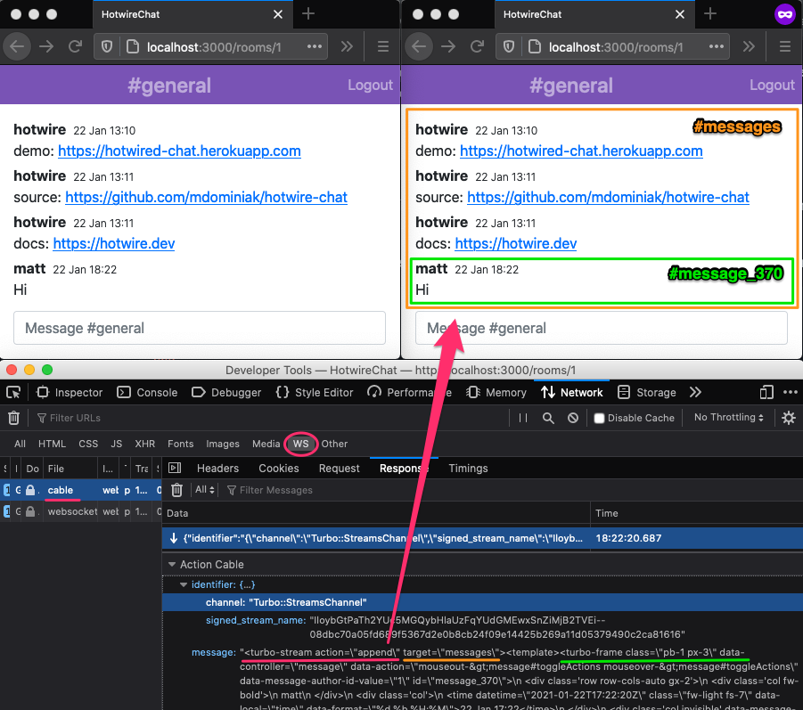
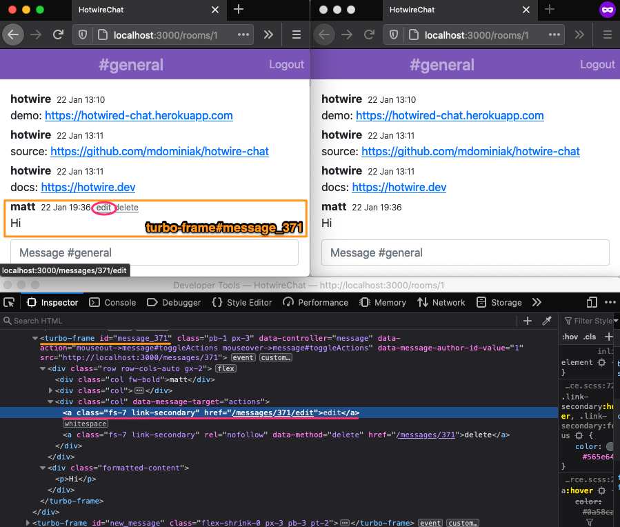
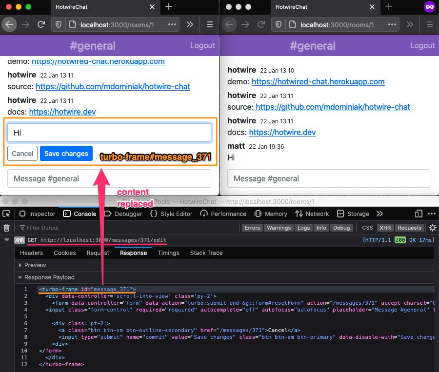

# Hotwire Chat


Demo chat web application built in Ruby on Rails with [Hotwire](https://hotwire.dev).<br />The demo is available at: https://hotwired-chat.herokuapp.com


## Creating message


When message form is submitted to the `POST /rooms/1/messages` endpoint, the [messages#create](app/controllers/messages_controller.rb) controller action

```ruby
class MessagesController < ApplicationController
  def create
    @message = @room.messages.new(message_params)
    @message.author = current_user

    if @message.save
      render turbo_stream: turbo_stream.append(:messages, @message) # <--
    else
      render 'new', layout: false, status: :unprocessable_entity
    end
  end
end
```

returns the following response:

```html
<turbo-frame action="append" target="messages">
  <fragment>
    <!-- app/views/messages/_message.html.erb partial -->
    <turbo-frame id="message_367" ...>
      ...
    </turbo-frame>
  </fragment>
</turbo-frame>
```

which is turbo stream action appending html fragment of newly created message to `#messages` container element. DOM updates are automatically handled by Turbo javascript on client side. The `turbo_stream` method used in the controller code is provided by [turbo-rails](https://github.com/hotwired/turbo-rails) gem.

### Broadacasting created message

When visiting a chat room page `GET /rooms/1`, the client automatically subscribes to the room channel turbo stream via ActionCable web socket. The subscription instruction is included in [rooms/show.html.erb](app/views/rooms/show.html.erb) view rendered by [rooms#show](app/controllers/rooms_controller.rb) action:

```ruby
# app/views/rooms/show.html.erb
<%= turbo_stream_from @room %>
```

Besides subscription, Turbo will automatically unsubscribe from the channel when navigating away from the room page, for example, when logging out.

All message changes (create, update, destroy) are asynchronously broadcasted to the message's room channel.

```ruby
# app/models/message.rb
class Message < ApplicationRecord
  broadcasts_to :room
end
```

On creating a new message in [messages#create](app/controllers/messages_controller.rb) controller action, turbo stream append action is broadcasted to all message's room subscribers:



The broadcasting is not bound to controller actions only. Any call to `Message.create`, `message.update`, `message.destroy` triggering ActiveRecord callbacks will result in corresponding broadcasts. Particularly, it is possible to trigger broadcasts in the rails console.

## Editing message

The edit link is nested under the message turbo frame:



When a user clicks the link, the `GET /messaged/123/edit` [messages#edit](app/controllers/messages_controller.rb) endpoint returns the turbo frame with the matching identifier containing the message form:

```ruby
# app/views/messages/edit.html.erb
<%= turbo_frame_tag dom_id(@message) do %>
  <%= render 'form', message: @message %>
<% end %>
```

On receiving a response containing turbo frame with matching identifier, Turbo replaces the content of the turbo frame:



## Updating message

### Broadcasting updated message

## Canceling message edit

## Deleting message

### Broadcasting deleted message

# Testing
