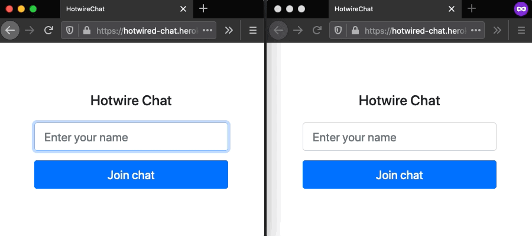

# Hotwire Chat


Demo chat web application built in Ruby on Rails with [Hotwire](https://hotwire.dev).<br />The demo is available at: https://hotwired-chat.herokuapp.com



## Creating message


When message form is submitted, the `POST /rooms/1/messages` endpoint

```ruby
def create
  @message = @room.messages.new(message_params)
  @message.author = current_user

  if @message.save
    render turbo_stream: turbo_stream.append(:messages, @message)
  else
    render 'new', layout: false, status: :unprocessable_entity
  end
end
```

return the following response:


which is turbo stream action appending created message html fragment to `#messages` container element. The turbo stream is automatically handled by Turbo javascript on client side.

```html
<turbo-frame target='test'>
</turbo-frame>
```

